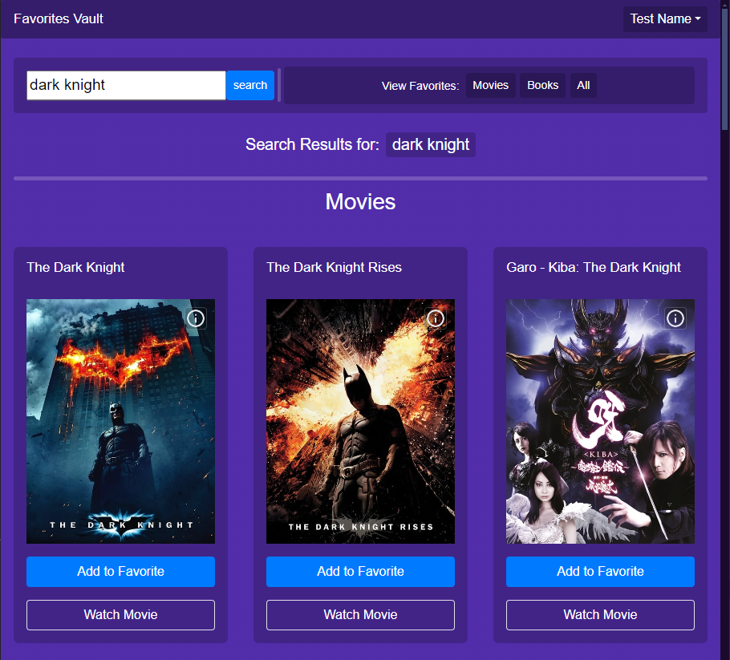

# Favorites Vault



## Description

Favorite Vault is a web application that  helps users search for and manage their favorite movies and books. Favorite Vault allows users to explore a database of movies and books, add their favorites to a personalized list, and manage their collection.  

Application is live at: https://favorite-vault.onrender.com/  
<br>
[](https://favorite-vault.onrender.com/)


## Table of Content
- [Features](#features)
- [Technologies](#technologies)
- [Getting Started](#getting-started)
- [Installation](#installation)
- [Usage](#usage)
- [Collaborators](#collaborators)
- [Contribution Guidelines](#contribution-guidelines)
- [License](#license)

<br>

## Features

- **User Authentication:** Secure user login and registration.
- **Search Functionality:** Search engine that allows users to find movies and books.
- **Favorites Management:** Users can add movies and books to their favorites list, view their collection, and remove items when needed.
- **Password Management:** Users can update their passwords and manage their account details.
- **Database Integration:** Database integraation for storing user data, favorites, and search history.
- **Responsive Design:** A responsive design across all devices.

<br>

## Technologies
Technologies Used:

- **Frontend:** HTML, CSS, JavaScript, jQuery, Bootstrap
- **Backend:** Node.js, Express.js
- **Database:** PostgreSQL, Sequelize ORM
- **Authentication:** Bcrypt for password hashing
- **Environment Management:** dotenv for environment variables
- **Version Control:** Git, GitHub
- **Deployment:** Render

<br>

## Getting Started

This section will guide you through setting up the project locally. By the end of this guide, you will have a working version of My Project running on your machine.

### Prerequisites

Before you begin, ensure you have the following installed:

- [Node.js](https://nodejs.org/) (v14.0 or later)

- [Git](https://git-scm.com/)

- A text editor like [VSCode](https://code.visualstudio.com/)

<br>

## Installation
Follow these steps to get your development environment set up:
```bash
git clone https://github.com/febres0492/favorite-vault.git
cd favorite-vault
npm install
```

<br>

## Usage
Follow these steps:
```bash
npm start
```

<br>


## Collaborators

[**Fabricio Guacuto**](https://github.com/fabricioGuac)  
[**Faisal Salam**](https://github.com/fsalam1984)  
[**Mike Smith**](https://github.com/mikejsmith9843)  
[**Carlos Febres**](https://github.com/fabricioGuac)  

<br>

## Contribution
Contributions are welcome


## Contribution Guidelines
Please get in contant for details on our code of conduct, and the process for submitting pull requests to us.

<br>

## License

[](https://opensource.org/licenses/MIT)

This project is licensed under the MIT License - see the [LICENSE](https://opensource.org/licenses/MIT) for details.
